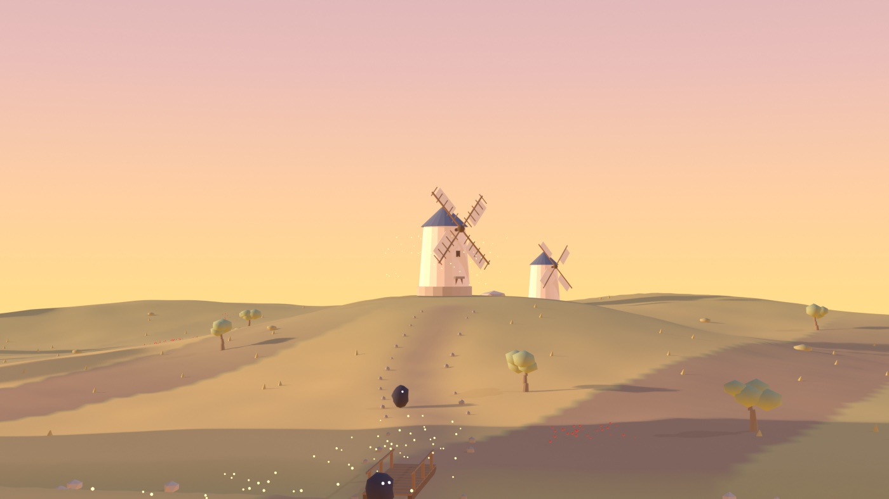
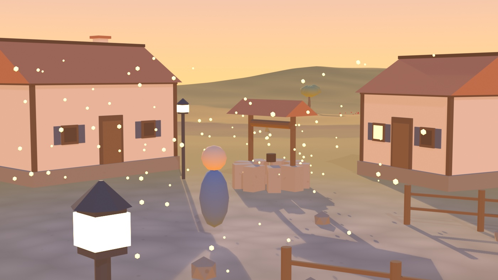

# 01 — Terreno 1: La Mancha

El mundo natal de Alonso y el primer mapa jugable. Llanura de 300 × 300 m con
el pueblo al oeste y la colina de los molinos al noreste, unidos por un camino.

Archivo: `anima/T1_LaMancha.blend` · generador: `anima/gen_t1_lamancha.py`

## v2 — segundo pase de detalle

La v1 era honestamente pobre: conos y cilindros repartidos por un plano. La v2
metió densidad de detalle secundario, que es lo que separa un bloqueo de un
escenario:

- Casas con zócalo de piedra, vigas de esquina, contraventanas, chimeneas y
  **ventanas encendidas** — el truco de Twilight Town, luz cálida que da vida.
- Venta en L con tapia, cartel colgante, cajas y barriles. Carro junto a la era.
- Plaza empedrada con pozo de sillares y torno; faroles de hierro encendidos.
- **Arroyo seco con puente de madera** cruzando el camino, con piedras en el lecho.
- Llanura con franjas de cultivo (trigo / rastrojo / arada con surcos reales en
  la geometría), viñedos en filas, olivos de tronco retorcido, cipreses,
  penachos de hierba y parches de amapolas.
- Tres molinos en la cresta, no uno: la silueta de Consuegra.
- Cielo con disco solar y nubes retroiluminadas.

114 objetos, terreno de 40.401 vértices, 60 fps.

## Lo que se aprendió

**El degradado del cielo salía invertido** (naranja arriba, azul abajo). El
vector `Incoming` del nodo de geometría en un shader de mundo apunta *hacia* la
cámara, no hacia donde miras: hay que negarlo para que +Z sea el cénit.

## Pendiente

- Segundo pase con el listón del molino: el mapa está a nivel v2, el molino ya
  está muy por encima.
- Las tres Pesadillas del camino son bultos provisionales. El diseño de
  enemigos recurrentes **no está decidido** y no debe darse por decidido.
- Sin interiores conectados todavía.
