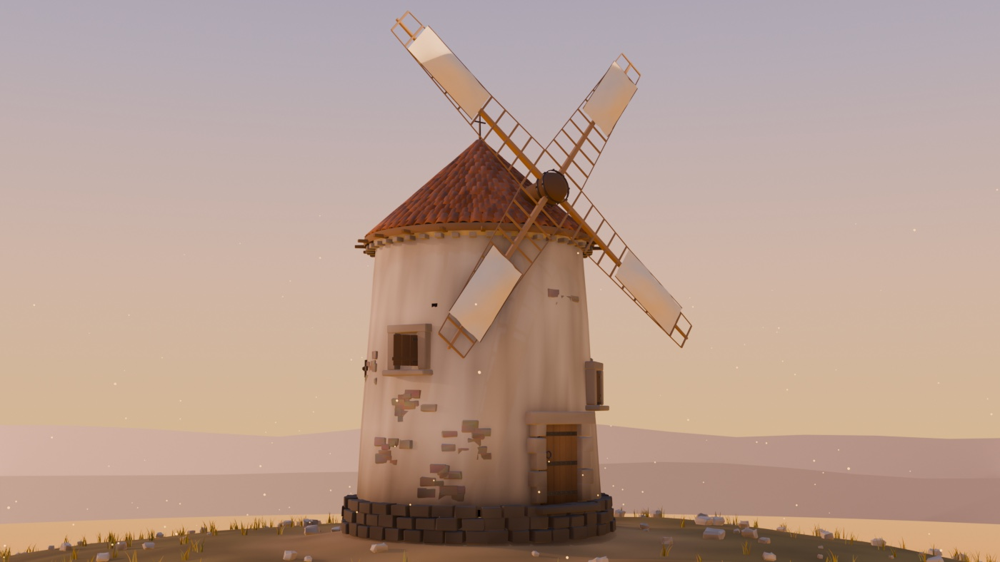
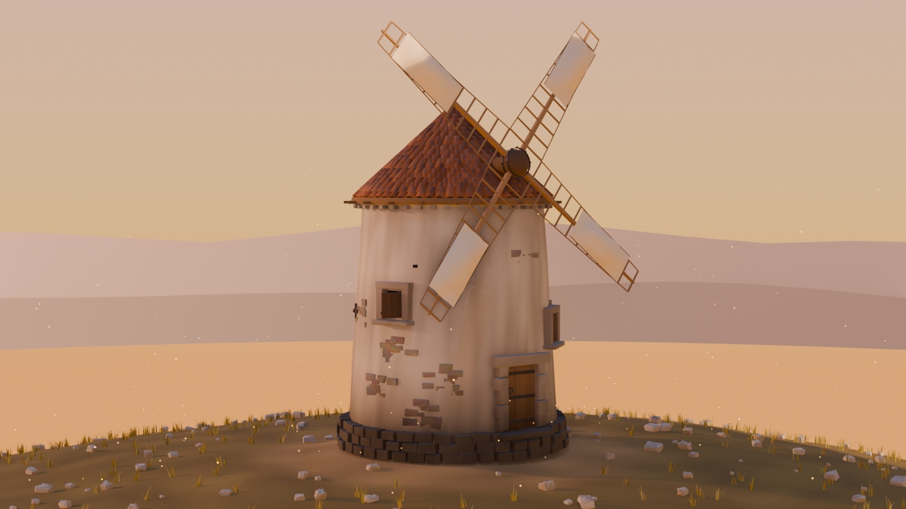
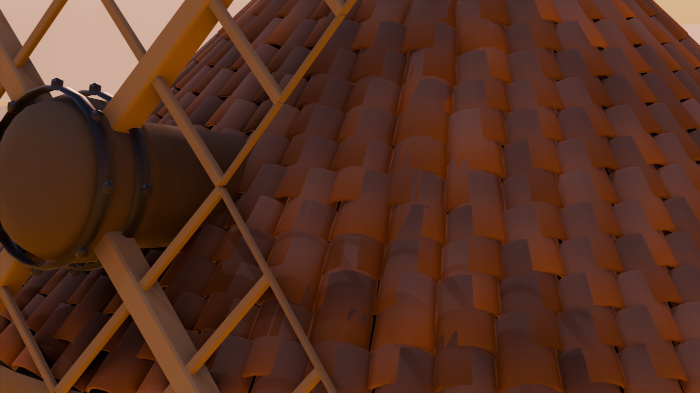
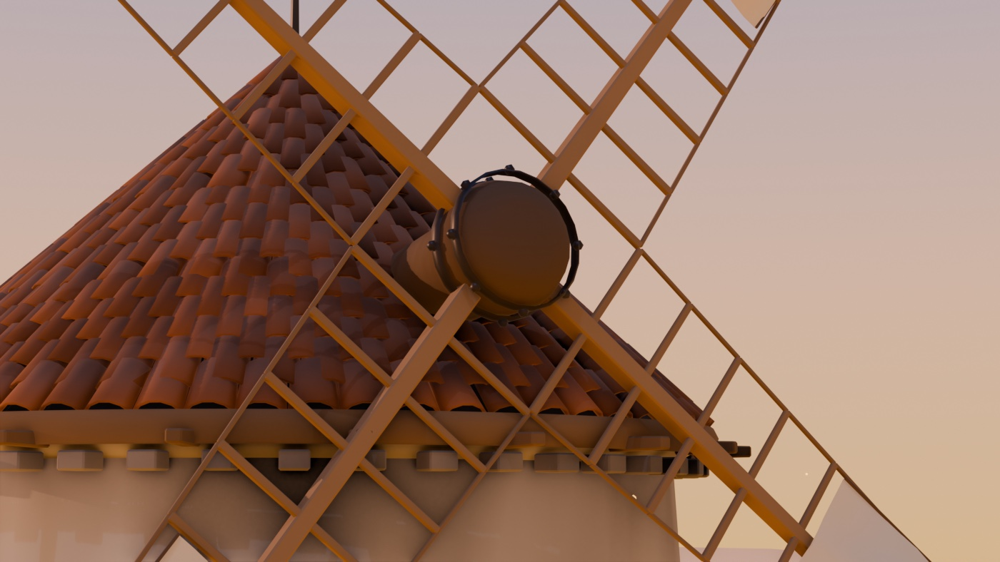
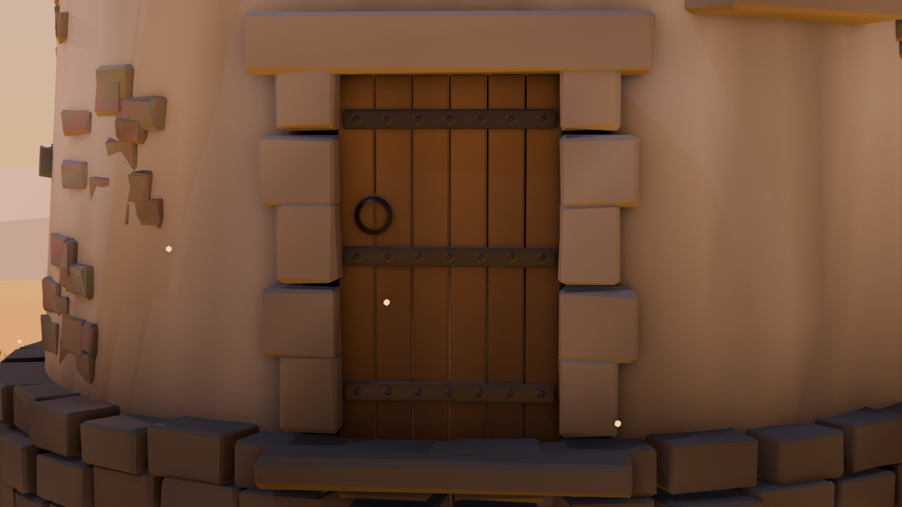

# 02 — El Molino

La pieza que fijó el listón de calidad del proyecto. Molino manchego sobre el
cerro, al final del camino que sale del pueblo.

Archivo: `anima/Molino.blend` · generador: `anima/gen_molino.py`

## La decisión: una pieza excelente en vez de un mapa entero mediocre

Venimos de un mapa lleno de primitivas. El cambio fue dejar de repartir esfuerzo
y concentrarlo: **una sola pieza, hecha de verdad**. Eso significó modelado real,
no primitivas escaladas.

## Cómo está hecho

**661 tejas colocadas una a una**, en 19 hiladas ascendentes sobre el faldón
cónico, con solape del 45 %, y cada una con su propio desvío de ángulo y su
propio tono. Es el detalle que vende el tejado.

**Las aspas** son celosía real: verga en punta, once travesaños que se acortan
hacia la punta, largueros cosiendo sus extremos, y la lona tendida sobre la
mitad exterior con panza y arrugas. El bocín lleva zunchos de hierro y pernos.

**La puerta**: jambas de sillería alternando soga y tizón, dintel, umbral
gastado, seis tablas cada una con su resalte, tres herrajes con clavos y aldaba.

El fuste es un torneado con **irregularidad de ruido**: el encalado a mano nunca
es un cilindro perfecto. Lleva desconchones donde asoma la mampostería,
mechinales en hélice (los huecos que dejó el andamio) y llaves de tirante.

Todo el desgaste va **pintado en el atributo de color por vértice**, no en
texturas: humedad en el arranque del muro, regueros bajo los alféizares, aguas
verticales de la cal.

## Los cuatro bugs que costaron el resultado

Vale la pena dejarlos escritos, porque tres eran de geometría y no se ven hasta
que se renderiza:

1. **`cbox` no centraba en Z.** Construía la caja de 0 a alto en vez de centrada,
   así que *todo* lo que la usaba quedaba medio alto: zócalo, dinteles, sillares.
2. **La verga del aspa crecía hacia el lado contrario a su celosía.** Rotación en
   Y con el signo cambiado. Visualmente parecía una cruz correcta, pero cada
   lattice estaba pegado al brazo de enfrente.
3. **La lona se montaba en el plano equivocado**, así que se veía de canto: una
   rotación de 90° en X que sobraba.
4. **El marco local de los huecos tenía Y y Z intercambiados**, y la puerta y las
   ventanas salían tumbadas como estanterías.

## Estado

Acabado. 67.995 caras. Arranca en el player sin errores.

## Provisional

`Molino_Aspas` es un objeto aparte con el pivote en el bocín, listo para que un
componente C++ lo haga girar. Todavía no gira.
