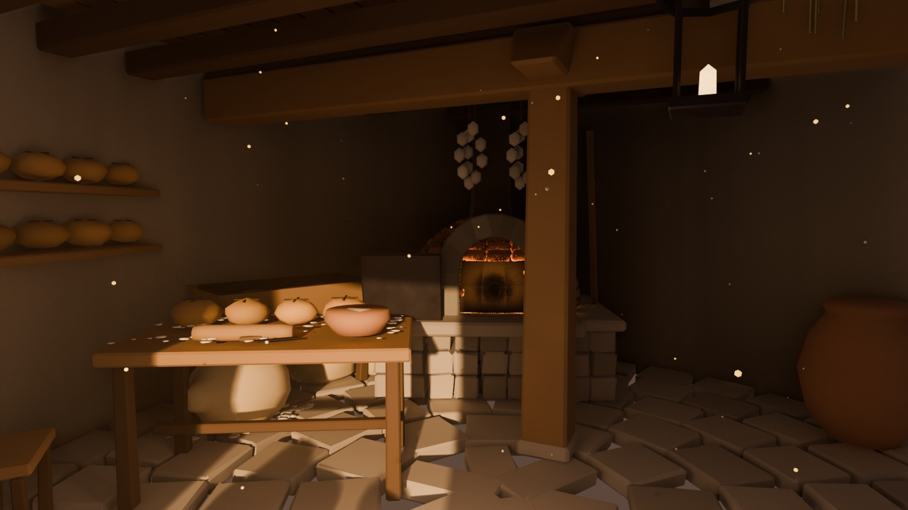
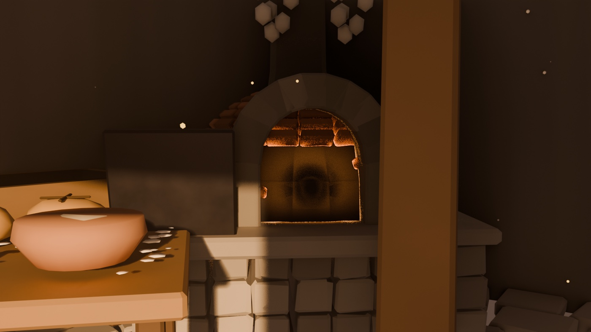
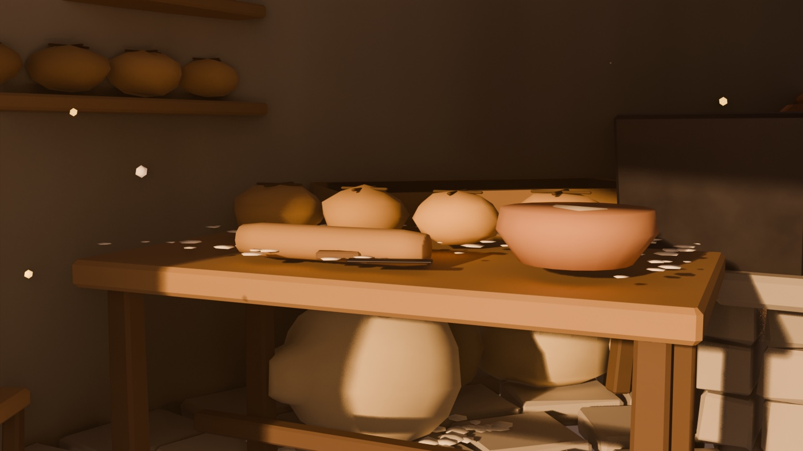
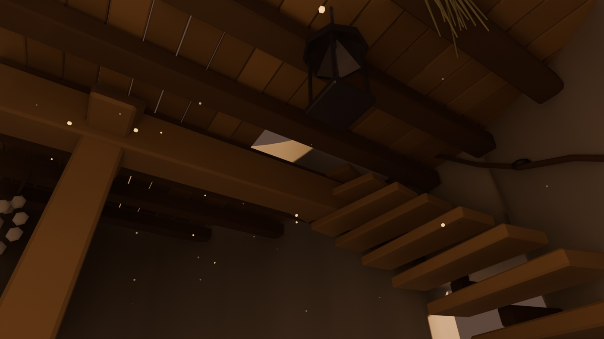
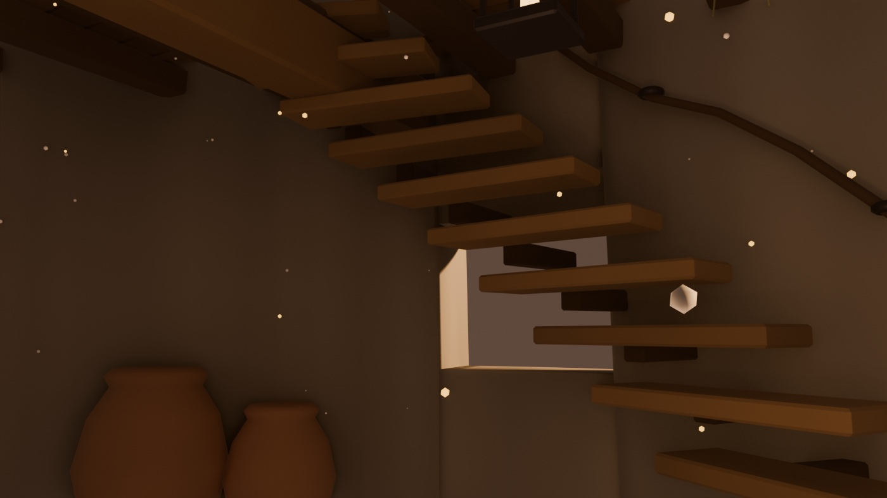

# 03 — Interior del Molino: la casa del panadero

La planta baja del molino, habitada. Mismo listón que el exterior: si el tejado
de fuera va teja a teja, el horno de dentro va ladrillo a ladrillo.

Archivo: `anima/MolinoInterior.blend` · generador: `anima/gen_molino_interior.py`

## El horno de bóveda

**213 ladrillos colocados uno a uno** por hiladas sobre la media esfera,
saltándose automáticamente los que caen dentro de la boca. Poyo de mampostería
en tres hiladas, boca con jambas y **once dovelas** de arco de medio punto,
cámara ennegrecida con brasas encendidas, ceniza, humero y la puerta de hierro
apoyada al lado.

## El obrador

Artesa de amasar con la masa reposando bajo un paño, mesa con hogazas —con la
cruz marcada antes de entrar al horno—, cuenco de barro, rodillo y cuchilla,
palas de horno apoyadas en la pared, cinco sacos de harina (uno tumbado y
abierto, con la harina derramada), tinajas, cestas de mimbre, estante de dos
baldas, ristras de ajos y un farol encendido.

## Carpintería

Viga maestra sobre pie derecho con zapata y basa de piedra, nueve viguetas,
tarima tabla a tabla y **la trampilla abierta** al piso de la molienda. La
escalera son doce peldaños empotrados en el muro sobre canes, con soga de mano
en argollas de hierro.

## Dos suciedades opuestas

El desgaste vuelve a ir pintado por vértice, pero aquí hay **dos manchas que se
contradicen**: el **hollín**, que sube del horno y tizna pared y techo en un
radio de 3,4 m, y la **harina**, que se posa en el suelo y en las superficies
altas. Más el zócalo de roce y las aguas de la cal.

El haz de luz de la puerta lo dibuja una niebla volumétrica de harina en
suspensión. Las motas sueltas son solo el remate: la primera versión parecía
una nevada y hubo que reducirlas mucho.

## El kit compartido

Aquí se extrajo `anima_kit.py`, el kit de geometría común. El perfil de la
torre, el grosor del muro y la posición de los huecos viven ahí porque interior
y exterior **tienen** que encajar — y porque ya se había colado un bug de
centrado en `cbox`: con dos copias del helper, se arregla en una y sobrevive en
la otra.

## Estado

Acabado. 25.779 caras. Arranca en el player sin errores.

## Provisional

- Que el molino sea la casa del panadero es **decisión de escenario, no de
  guion**: nada aquí fija quién es el panadero ni qué papel tiene.
- El piso de arriba (la molienda: piedras, tolva, palahierro) no existe todavía.
  La trampilla ya está abierta esperándolo.
- No hay puerta modelada en el hueco: entra la luz directamente.
