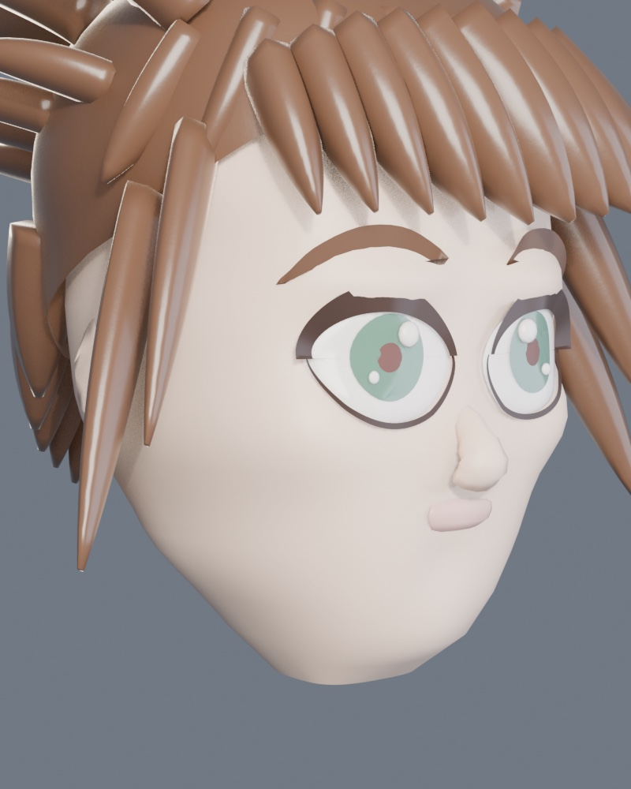
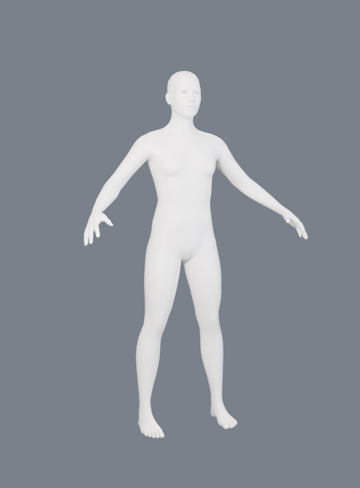

# 04 — Alonso Quijano

El protagonista. 15-16 años, 1,68 m. Estilizado tipo JRPG, con la expresividad
y las proporciones de aventura que buscamos.

**En curso.** Esta entrada documenta un cambio de método a mitad de camino.

## Intento 1 — generar la cara por código (descartado)

Mismo enfoque que funcionó con el molino: construir por código, con perfiles y
campos de desplazamiento. Cráneo lofteado desde perfiles reales (frontal,
lateral, nuca), esculpido con campos para cuencas, pómulos, arco superciliar,
mandíbula y mentón. Ojos grandes con iris en cúpula y pestaña en creciente.
Pelo por mechones barridos. Materiales PBR con subsurface en la piel y
anisotropía en el pelo.

Se conserva en `anima/gen_alonso.py` como referencia del intento.

### Por qué se descartó

Mirando el resultado con ojos críticos: la cara es larga y plana, la nariz y los
labios son bultos, el pelo son cuñas gruesas. Está a la altura de un personaje
de relleno, no de un protagonista que aguante un primer plano.

Y no es falta de detalle: **es que el método no da para esto**. Un molino sale
bien generado por código porque es geometría regulada — hiladas, dovelas, tejas,
cosas que obedecen reglas. Una cara atractiva no obedece reglas: depende de
topología dispuesta en anillos que siguen ojos y boca (lo que permite un
parpadeo y una sonrisa creíbles) y de miles de decisiones escultóricas de
milímetro que no se parametrizan.

### El bug que costó dos intentos

`face_pt`, la función que devuelve la superficie de la cara en un punto, usaba
una parametrización **distinta** a la de la malla: `|x|/w` en vez del ángulo del
loft. Devolvía la superficie casi 2 cm por detrás de donde estaba de verdad, así
que todo lo que se apoyaba en ella —ojos, pestañas, cejas— se enterraba dentro
de la cabeza. Los ojos desaparecieron dos veces antes de encontrarlo.

## Intento 2 — base humana esculpida (en curso)

Se cambió a partir de una malla base ya resuelta, generada con **MPFB2**.

19.158 vértices, 1,66 m, ajustada a chico de ~16 años. Nariz, labios, párpados,
orejas y cuencas ya esculpidos, y sobre todo **topología en anillos** alrededor
de ojos y boca.

Generador: `anima/gen_alonso_base.py`

### Sobre la licencia

MPFB2 es **GPLv3**, y lo que genera es **CC0**: uso comercial permitido, incluso
en juego cerrado. Esto importa y se deja escrito: en ÁNIMA **no entra material
protegido de terceros ni modelos extraídos de otros juegos**. Kingdom Hearts es
referencia de sensación y alcance, nunca de contenido.

## Siguiente

1. Pase de estilización: cabeza algo mayor, ojos grandes de JRPG, rasgos suavizados.
2. Ropa con riqueza visual y movimiento.
3. Rig completo con huesos faciales y secundarios (pañuelo, ropa).
4. Expresiones para cinemáticas.
5. Materiales PBR diferenciando tela, cuero, metal y piel.
6. LODs.
