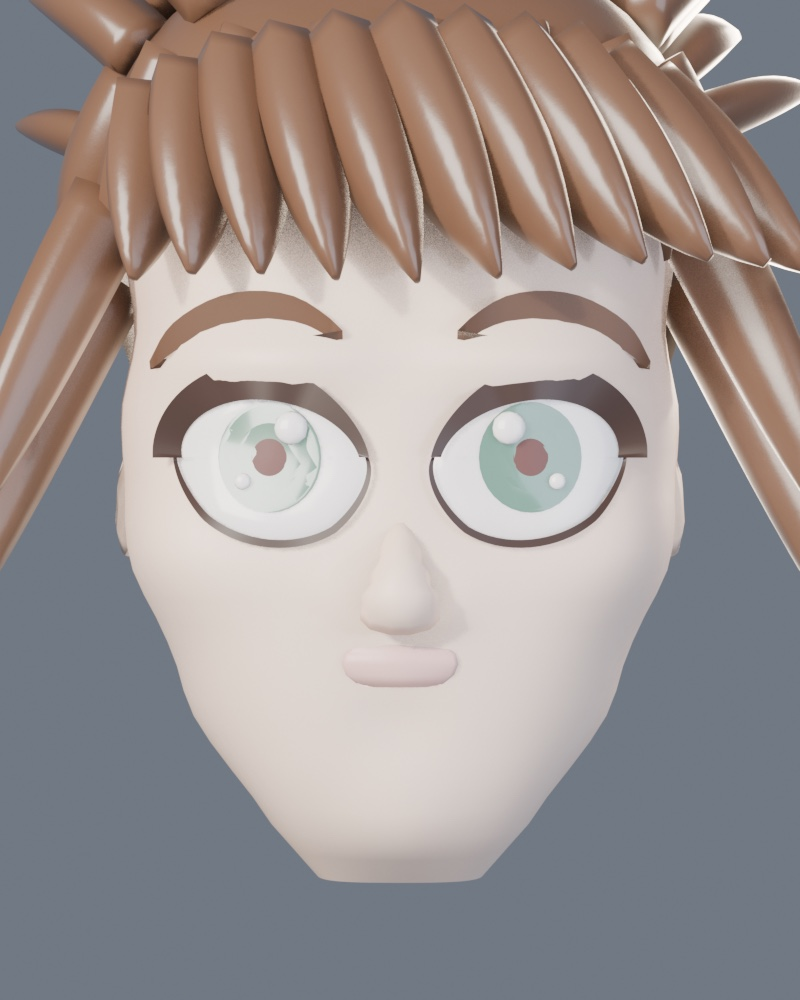
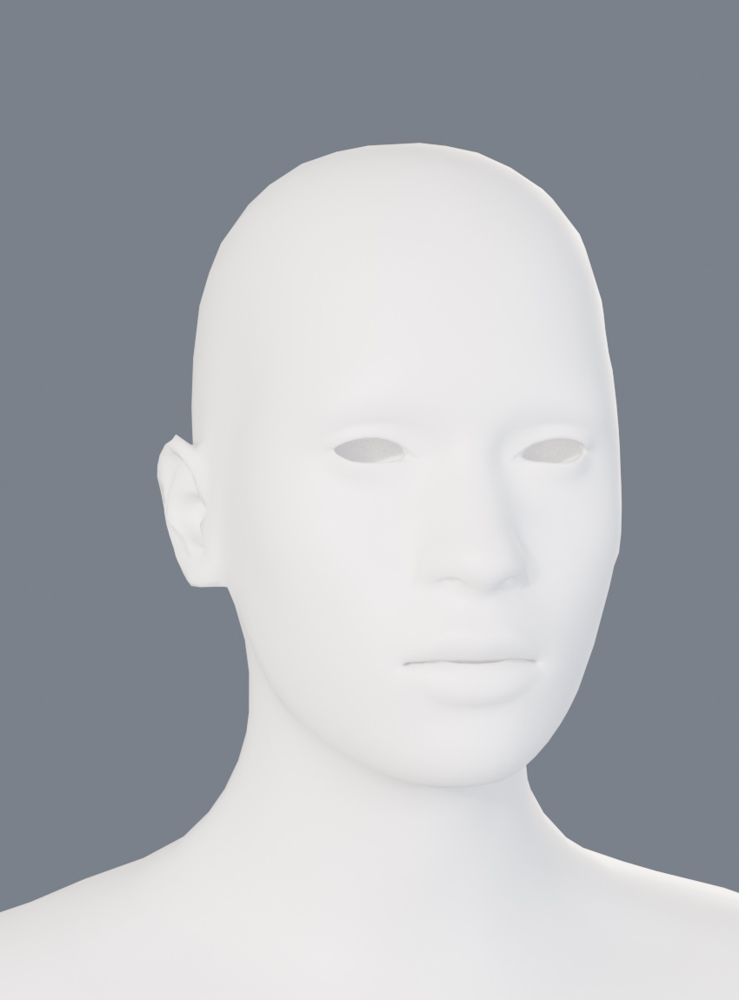
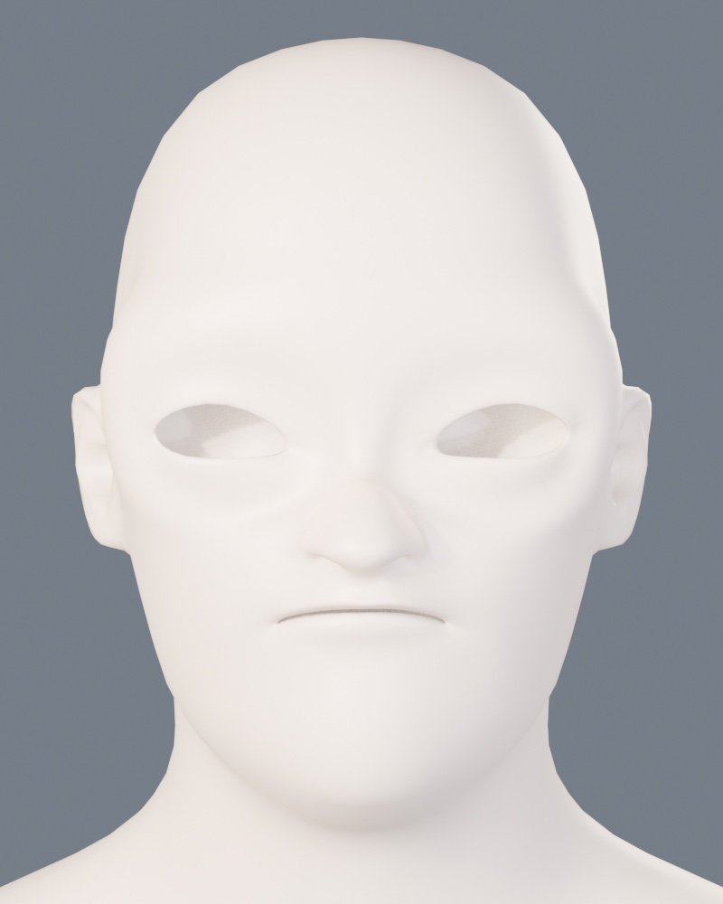
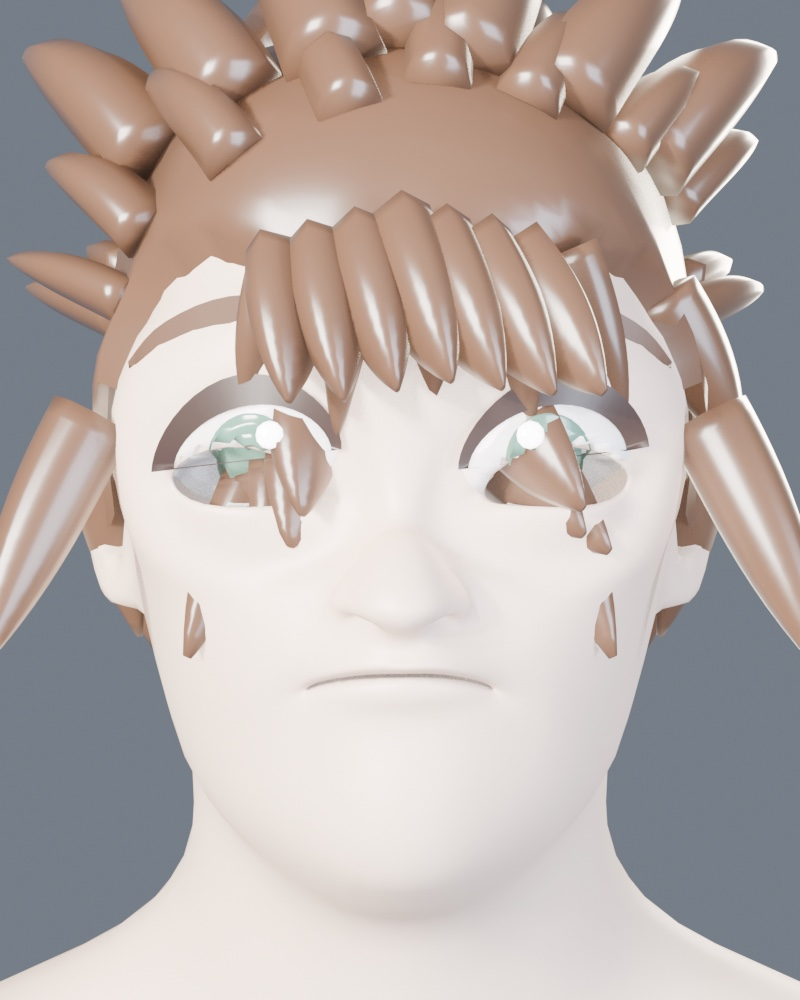
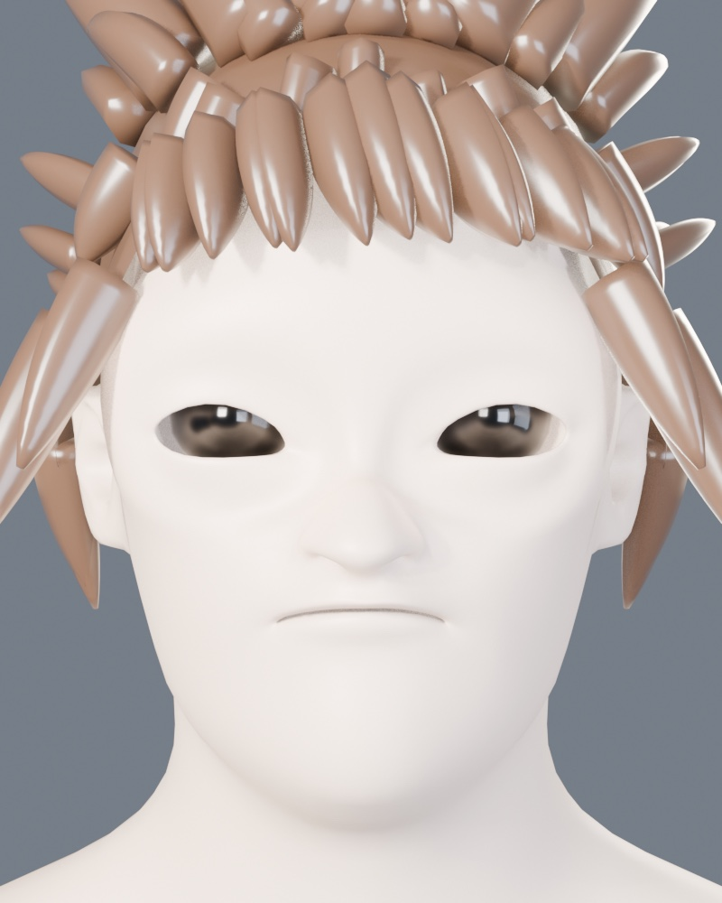
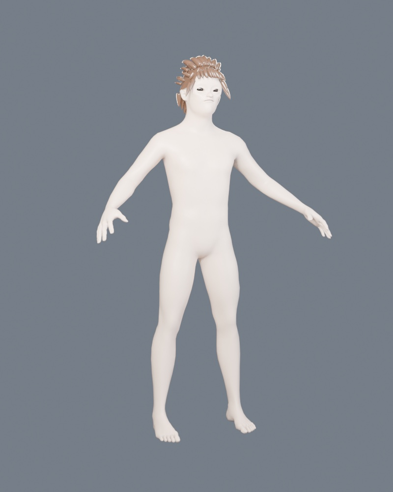
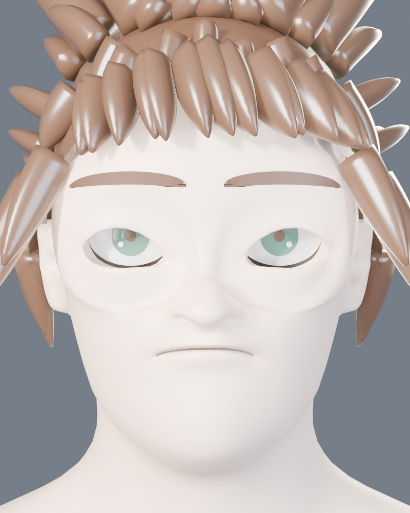

# 04 — Alonso Quijano

El protagonista. 15-16 años, 1,68 m, estilizado tipo JRPG.

**En curso.** Esta entrada documenta dos cambios de método y lo que falta.

---

## v1 — generar la cara por código (descartado)

Mismo enfoque que funcionó con el molino: perfiles y campos de desplazamiento.

Se conserva en `anima/gen_alonso_procedural_descartado.py`.

**Por qué se descartó.** La cara es larga y plana, la nariz y los labios son
bultos, el pelo son cuñas. No es falta de detalle: **el método no da para esto**.
La geometría regulada (tejas, dovelas, hiladas) sale muy bien generada por
código porque obedece reglas. Una cara atractiva no: depende de topología en
anillos alrededor de ojos y boca —lo que permite parpadeo y sonrisa creíbles— y
de decisiones escultóricas que no se parametrizan.

**El bug que costó dos intentos.** `face_pt`, la función que devuelve la
superficie de la cara, usaba una parametrización **distinta** a la de la malla
(`|x|/w` en vez del ángulo del loft). Devolvía la superficie casi 2 cm por
detrás de donde estaba, así que ojos, pestañas y cejas se enterraban dentro de
la cabeza. Los ojos desaparecieron dos veces antes de dar con ello.

---

## v2 — base esculpida + estilización (actual)

Se parte de una malla humana ya resuelta, generada con **MPFB2**, y se deforma.

| Antes: base MPFB2 | Después: estilizado |
|---|---|
|  |  |

**Qué hace el pase de estilización** (`anima/gen_alonso_estilo.py`): fija el
fenotipo a joven caucásico masculino, agranda la cabeza un 13 % (más ancha que
larga), **abre los ojos 2,15×** en vertical, encoge la nariz a menos de la
mitad, estrecha la mandíbula, redondea la barbilla, suaviza ceja y pómulo,
agranda algo las manos y normaliza la estatura a 1,68 m.

13.380 vértices tras podar la geometría auxiliar de MPFB.

### El orden importa, y costó tres vueltas averiguarlo

1. **Fijar el fenotipo primero.** Las propiedades `MPFB_HUM_*` por sí solas no
   reconstruyen la malla — no disparan el callback de MPFB. Estuve trabajando
   sobre el neutro andrógino sin saberlo. Se fija a mano la mezcla de shape keys.
2. **Hornear los shape keys antes de tocar vértices.** Mientras existan, escribir
   en `vertices[].co` **no cambia nada**: manda la mezcla de claves. Dos pases
   enteros no surtieron efecto por esto.
3. **Medir las referencias después de hornear**, no antes: el morph mueve la cara
   y las referencias quedan desfasadas (la nariz encogía donde ya no estaba).
4. **`.copy()` en las referencias.** `v.co` es un proxy RNA; al podar vértices la
   referencia queda colgando y Blender casca.

También: MPFB deja un modificador *Mask* que oculta los helpers, así que la malla
evaluada tiene menos vértices que la base y los índices no casan — la mezcla se
calcula a mano. Y tras deformar por campos hay que **relajar** la zona tocada, o
queda un reborde tipo antifaz alrededor de los ojos.

### Sobre la licencia

MPFB2 es **GPLv3** y lo que genera es **CC0**: uso comercial permitido, incluso
en juego cerrado. En ÁNIMA **no entra material protegido de terceros ni modelos
extraídos de otros juegos**. Kingdom Hearts es referencia de sensación, nunca de
contenido.

---

## v3 — buscar cómo se hace en vez de inventarlo

El paso 3 (ojos y pelo) no salía. En vez de seguir tocando parámetros, se buscó
cómo lo resuelve la gente en Blender. Dos cosas cambiaron el resultado:

### 1. El pelo se ajusta con Shrinkwrap, no con raycast

| Antes: ajuste por rayos | Después: Shrinkwrap |
|---|---|
|  |  |

Yo lanzaba rayos desde un punto dentro de la cabeza para encontrar el cráneo.
Falla porque **una cabeza no es convexa**: a poca altura el rayo choca con el
pómulo o la nariz, y el casquete salía en lengüetas dentadas.

El **modificador Shrinkwrap** en modo *Nearest Surface Point* resuelve el punto
**más cercano** de la superficie, no el primer impacto de un rayo. Es además la
técnica estándar documentada para casquetes de pelo. El casquete quedó limpio a
la primera. Las raíces de los mechones nacen del casquete ya ajustado.

### 2. Los ojos salen de un pack CC0 ajustado a esta misma base

MakeHuman publica un pack de assets de sistema con globos oculares **ajustados a
la malla base de MPFB2** — la misma que usa Alonso. No hay que adivinar el
encaje: ya encaja.

Los globos se **trasladan y escalan uniformemente**, no se pasan por el campo de
deformación: ese campo es anisótropo a propósito (abre el párpado 2,15× en
vertical) y estiraba el globo con su iris, dejando el ojo negro.

Vienen con UV y texturas de iris. Todo CC0, declarado en la cabecera de los
propios `.obj`: *"This asset was explicitly released as CC0 in september 2020"*.
Guardado en `anima/assets/` con su `LICENCIA.md`.

---

## v4 — gramática facial del género

Dirección: facciones y ojos de JRPG. Eso es **estilo**, no diseño: proporciones
y lenguaje visual del género. Alonso sigue siendo suyo — su pelo, su color de
ojos, su cara.

| v3: ojo esférico realista | v4: ojo plano de género |
|---|---|
|  |  |

**El ojo pasa a ser plano.** Un globo esférico realista, por muy bien ajustado
que esté, deja una almendra oscura: el iris llena el hueco y no asoma
esclerótica. Los ojos de este estilo son **geometría plana** con esclerótica,
iris grande, pupila y brillos como piezas separadas. Ahora hay eso, más línea de
pestaña y ceja.

**Y va como calcomanía, sin recortar el párpado.** Se probó a abrir un hueco en
la piel: en una malla de rejilla el borde queda escalonado, y taparlo con la
pestaña resultó frágil. Como la cara ya está aplanada en la zona del ojo, el ojo
se apoya encima, un pelo por delante. El contorno lo define el propio ojo, así
que sale limpio.

**La cara se aplana.** Se añadió un campo que rebaja el relieve del plano facial
en la zona de pómulo y ceja. Ese relieve es lo que la hacía leer como adulta
realista; los rasgos de este estilo van sobre una cara plana. Además: cabeza al
115 %, apertura del ojo 2,85× en vertical, nariz al 32 %, boca al 78 %.

### Tres tropiezos de esta tanda

- `(1 - sc²) ** 0.6` con `sc > 1` da **base negativa y exponente fraccionario**:
  Python devuelve un complejo y Blender casca al asignarlo a un vector.
- La esclerótica iba **0,6 mm** por delante de la pestaña y la tapaba entera.
- La pestaña superior creció tanto que **se confundía con la ceja**.

---

## Lo que sigue sin estar

- **La mirada no lee.** El iris llena toda la apertura del párpado y el ojo queda
  como una almendra oscura. Falta que asome esclerótica y falta pestaña, que es
  lo que da expresión. Las búsquedas apuntan a que los ojos anime se modelan
  **planos**, no esféricos — probablemente haya que sustituir el globo por
  geometría plana con iris, pupila y brillo como piezas separadas.
- **Los mechones siguen siendo conos gruesos.** El casquete está bien; los
  mechones que salen de él, no. La vía documentada es curvas con *bevel* y perfil
  de *taper*, o tiras de malla, no barridos cónicos.
- Piel demasiado pálida, sin variación de tono.
- Sin ropa, sin rig, sin expresiones, sin LODs.

## Anexo — el intento fallido de v2 (referencia)

El paso 3 (`anima/gen_alonso.py`, con `RASGOS = True`) monta ojos y pelo. **Sale
mal** y se deja documentado en vez de esconderlo:

El casquete de pelo baja por la cara en lengüetas dentadas y los parches de ojo
salen fragmentados. Los dos fallos tienen **la misma causa**: el ajuste se hace
lanzando rayos desde un único punto dentro de la cabeza, y **una cabeza no es
convexa**. A elevaciones bajas el rayo choca con el pómulo o la nariz en vez de
con el cráneo, y el resultado es irregular.

La corrección no es tocar parámetros, es cambiar el método de ajuste: proyectar
sobre la malla con *shrinkwrap* (que resuelve el punto más cercano, no el primer
impacto de un rayo), o construir el casquete a partir de una región del mapa UV
del cuero cabelludo en vez de por rayos radiales.

Con `RASGOS = False` (por defecto) el paso 3 solo aplica materiales PBR y deja el
cuerpo estilizado limpio, que es lo que hay ahora en `Alonso.blend`.

## Siguiente

1. Rehacer el ajuste de ojos y pelo por proyección, no por rayos.
2. Ropa con riqueza visual y movimiento.
3. Rig con huesos faciales y secundarios (pañuelo, ropa).
4. Expresiones para cinemáticas.
5. LODs.
