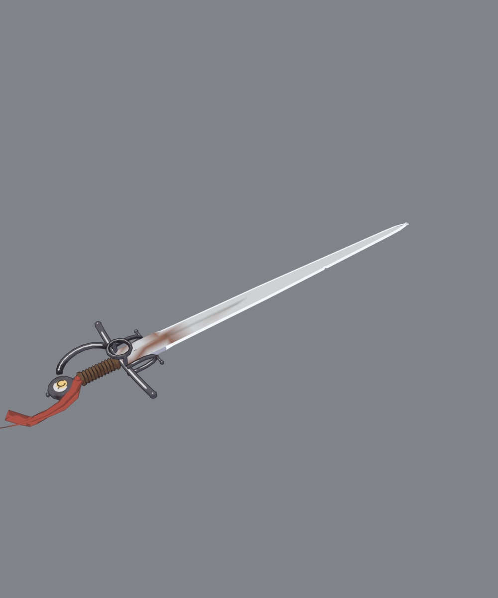
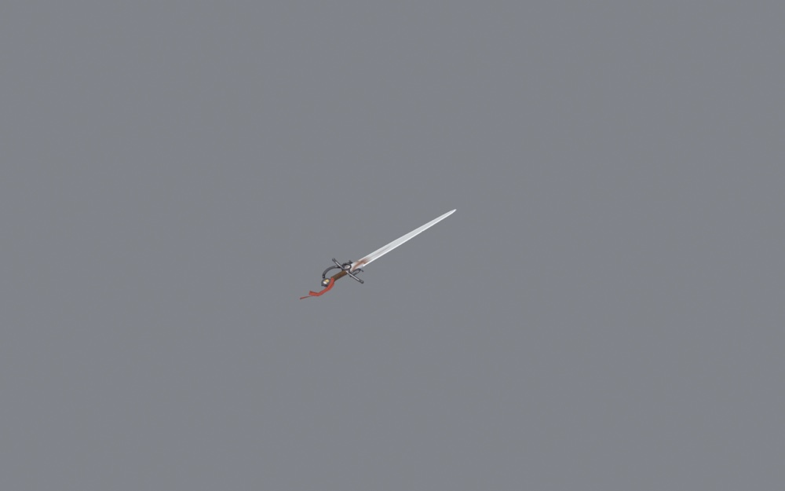

# 05 — La espada de Alonso

La reliquia. En el capítulo I, Alonso Quijano limpia «unas armas que habían sido de
sus bisabuelos, que, tomadas de orín y llenas de moho, luengos siglos había que
estaban puestas y olvidadas en un rincón». Tres generaciones antes de ~1600 son
75-90 años: **la espada se forjó hacia 1510-1530**, y eso decide su tipo. No es un
estoque de 1620 ni una taza: es una **ropera de lazo temprano**, de hoja ancha,
cruz con patillas, pitones con bolita, anillo sobre el arriaz y guardamano curvo.

Generador: `anima/gen_espada.py` → `Espada.blend` (2.824 tris). Ficha con las
fuentes: `conocimiento/16-espada.md`.

## v1 → v3 (noche del 12 al 13 de septiembre de 2026)

| 3/4 | A 7 m, la distancia del juego |
|---|---|
|  |  |

Lo que se midió antes de decidir el tamaño, porque «icónica» no es un número:

- 111 roperas históricas de 1570-1630 (anexo de Vauthier): hoja **mediana 108 cm**,
  empuñadura más pomo 15,8 cm. Dos piezas españolas del Met (25058 y 25641):
  guarnición de 25 × 14 cm y 23 × 9 cm.
- La Llave Espada de Sora, como **prototipo de silueta legible** (no de diseño):
  mide 0,667 de la estatura del personaje y su guarda es el 31 % del largo total.
  Es la proporción que hace que un arma se lea a 15 m; la espada de Alonso toma la
  **proporción**, no la forma.
- El brazo de Alonso: hombro→punta de dedos 0,552 m; mano 0,19 m. A 7 m con la lente
  del juego cada píxel son 3,9 mm, así que un detalle de menos de 8 mm no existe.

Tres versiones: la v1 era una espada histórica a escala 1:1 y desaparecía en la
captura de juego; la v2 exageró guarnición y pomo; la v3 ajustó el largo para que
el impacto del combo (`reach` 2,2-2,8 m en `FL_ArpgCore.hpp`) coincida con la
punta.

## En la mano

`gen_alonso_rig.py` la appendea y la emparenta al hueso `hand_r`. La malla va
**espejada**: la quiralidad de la mano derecha exige que la empuñadura se ajuste
al revés que el modelo de referencia, y costó una vuelta descubrirlo (la espada
salía atravesando el antebrazo).

## Pendiente

- Desgaste: el «orín y moho» del texto todavía es color de vértice plano.
- Un cordón o cinta que ondee (hueso secundario), como pide la dirección de arte.
- Vaina y tiros en la pretina: hoy la espada nace en la mano.
