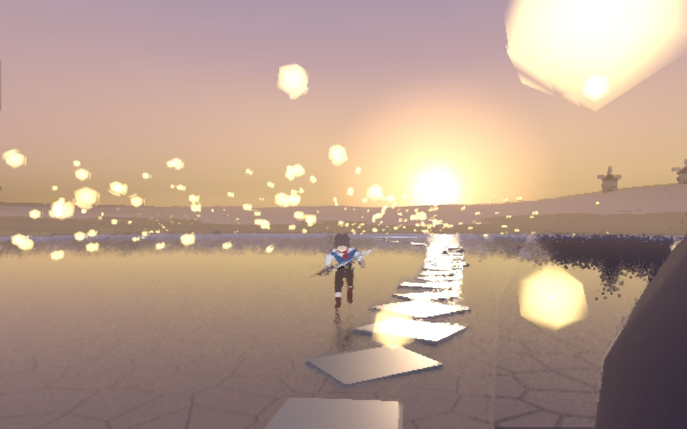
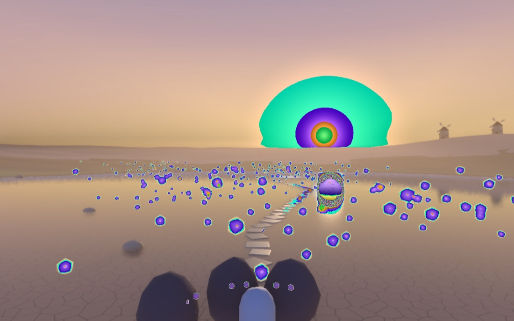
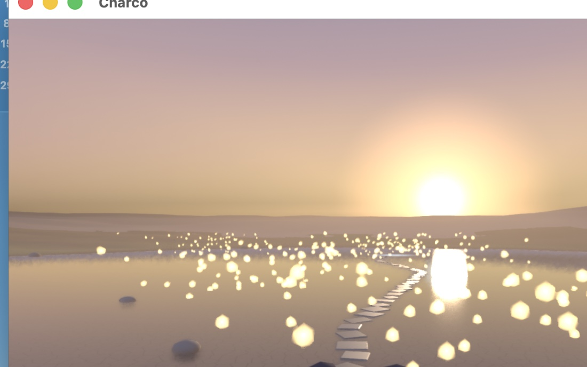
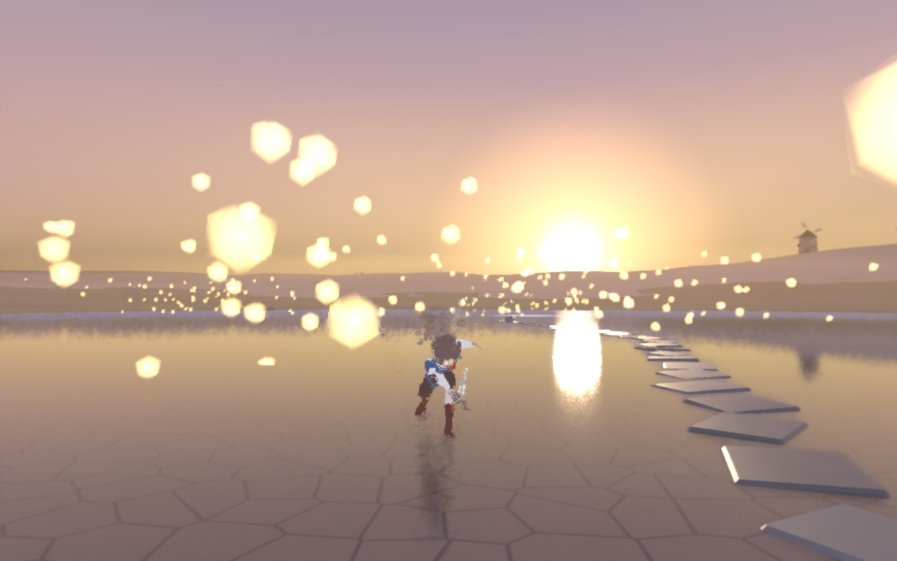

# 06 — El charco: el espejo de La Mancha

El encargo, literal: *«un charco grande con reflejo del sol, algo chulo, casi
mágico… y quiero poder caminar y que el cuerpo se mueva y poder pegar con una
espada»*. Es la primera escena en la que **Alonso se juega**.

Generadores: `anima/gen_charco.py` → `Charco.blend` (la escena) y
`anima/gen_escena_jugable.py` → `EscenaCharco.blend` (la escena con Alonso dentro).



## Jugar

```
open -a "Flipendo Player" --args ~/Flipendo/game/anima/EscenaCharco.blend
```

WASD para andar, **Shift** para correr, **J** o clic izquierdo para pegar (tres
golpes encadenados), espacio para saltar, ratón para orbitar la cámara. Las tres
Pesadillas del camino persiguen y pegan; con tres o cuatro golpes desaparecen.

## v1 (noche del 12 al 13 de septiembre de 2026)

### Lo que se decidió con número, no a ojo

El carril de visión midió referencias (el salar de Uyuni, atardeceres manchegos,
la composición de cámara en tercera persona) y las convirtió en parámetros
(`dev/noche/informes/anima-escena-vision.md`):

- **Sol a 5° sobre el horizonte** y 12° a la derecha del camino: el reflejo cae
  22,7 m delante del personaje, con un Fresnel del 58 %.
- **Disco solar de 4,4°** (8 veces el real). El de 7,1° que usaba el Terreno 1,
  reflejado, se comía al personaje.
- **Charco de 180 × 130 m**, agua Principled con roughness 0,03 y base
  (0,03, 0,04, 0,06): el espejo de Uyuni es agua de 1-2 cm quieta, sin olas.
- **Niebla de distancia** de 60 a 260 m con el color del horizonte: los tres
  molinos de `Molino.blend`, a 300 m, quedan al 80 % de niebla — siluetas.
- **Cámara 24 mm** a 7 m, con `fl_cam_pitch` a −5°: horizonte al 40 % del encuadre
  y personaje entre el 54 % y el 81 % del alto.
- Guion de color de **tres valores** (cielo/agua lejana, personaje/luz bajo el
  agua, orillas/juncos/molinos), el mismo cel de tres paradas del personaje.

### Lo que solo se sabe probándolo en el Player

El carril técnico no dio nada por bueno sin verlo en el Blenderplayer, y salieron
cuatro trampas que quedan escritas en `dev/noche/informes/anima-escena-tecnica.md`:

1. **La captura del motor mentía en todo lo que pasa de 1,0.** El buffer trasero
   de Metal es flotante y la lectura convertía a byte sin saturar: el disco solar
   salía verde y el reflejo en anillos, mientras la pantalla estaba bien. Se
   arregló en el motor (`saturate` en `compute_texture_read.msl`); la captura de
   abajo es de antes del arreglo, y la foto del sistema operativo, de la pantalla
   real de ese mismo momento.
2. El Player **solo respeta la cámara de la escena si el visor se guardó en vista
   de cámara**; si no, fabrica una cámara por defecto en otro sitio.
3. Con **dos cámaras** en la escena (la de juego y la de los renders) el Player
   pintaba desde la de renders. En la escena jugable solo queda `GameCamera`, y
   el componente C++ reafirma la cámara activa cada tic.
4. El **volumen del mundo sale negro** en este build. La atmósfera va por niebla
   de distancia y por las motas, no por volumétrico.

| Captura del motor (antes del arreglo) | Pantalla real en ese momento |
|---|---|
|  |  |

### Verificado sin nadie al teclado

El motor lleva `FL_ARPG_AUTOPLAY`, un guion de pulsaciones por frame. Con
`w:30-190;shift:90-190;j:200;j:222;j:244` el volcado del juego dice:

```
frame  40   accion=Andar@5.5     Player y=-28,83
frame 150   accion=Correr@16.5   Player y=-11,10   hp=84   (19,7 m en 110 frames)
frame 262   accion=Ataque3@11.4  Player y=-2,97    combo=active:2
```



### Provisional — NO es canon

- Las **Pesadillas** siguen siendo bultos oscuros; el diseño de los enemigos está
  sin decidir.
- Las motas son nubes de esferas emisivas con el componente `Flotar`; el sistema
  de partículas de verdad (ánima que reacciona al jugador) es trabajo futuro.
- El charco no hace ondas al pisarlo.

## Pendiente

- Ondas al andar por el agua y salpicaduras.
- Sonido: no hay.
- Ajustar la cámara para que Alonso lea algo más grande a 7 m sin perder el
  reflejo (hoy ocupa el 26 % del alto).
- Volumétrico cuando el build lo pinte.
